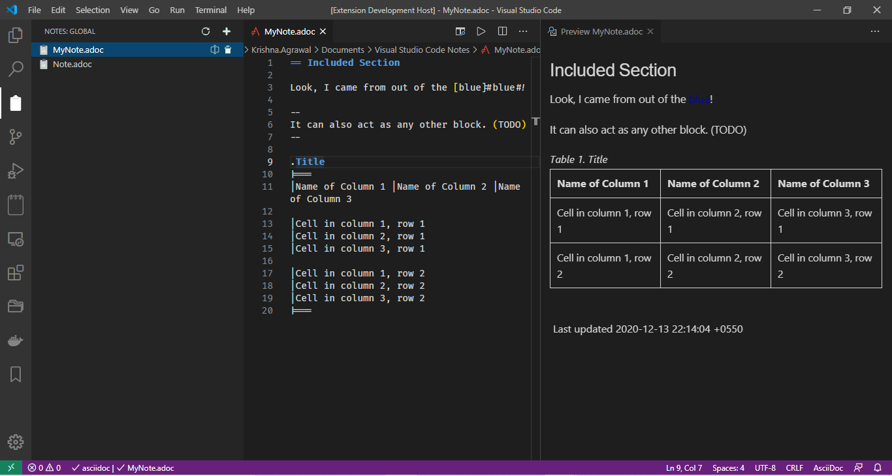

# vNotes
## Features

vnotes is simple extension allow user to create notes and store them at single location anywhere on the system.

## Requirements
  vnotes support different types of files like markdown and asciidoc. based on type of notes you're using support plugins needs be installed.
  * [AsciiDoc Extension](https://marketplace.visualstudio.com/items?itemName=asciidoctor.asciidoctor-vscode)
  * [Markdown Extension](https://marketplace.visualstudio.com/items?itemName=yzhang.markdown-all-in-one
  )

## Extension Settings

This extension contributes the following settings `settings.json`:

* `notes.notesLocation`: set the location for the notes.
* `notes.notesExtension`: set file type `default` is `.adoc`
*
## Release Notes

Extension is in beta release and auto-preview supports available for asciidoc and markdown.

### 0.0.1

Beta release of extension support asciidoc and markdown with auto-preview.

### [Patreon](https://www.patreon.com/imkrishnaagrawal)

**Enjoy!**
